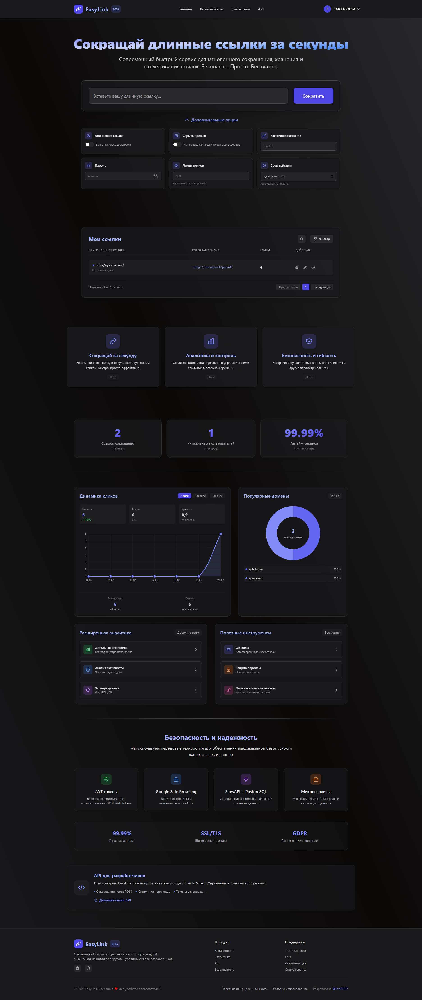

# Clickly

Clickly is a modern URL shortening service with analytics, user management, and security features.
Built on a microservices architecture, Clickly provides scalability, flexibility, and robust monitoring for all your URL shortening needs.

---

## Technologies

- **Python 3.11+** — backend logic for all microservices  
- **FastAPI** — high-performance API framework  
- **PostgreSQL** — primary relational database  
- **Docker & Docker Compose** — containerization and orchestration  
- **Traefik** — reverse proxy and routing  
- **SMTP** — email delivery  
- **HTML, CSS, JavaScript** — frontend (SPA)

---

## Project Structure

```bash
└── src
    ├── analytics-service # Analytics service (tracks URL visits and metrics)
    ├── urls-service # URL shortening and redirection service
    ├── frontend-service # User management and authentication service
    ├── users-service # Client application (SPA)
    ├── docker-compose.yml # Docker Compose configuration for all services
```

Each microservice contains its own business logic, API endpoints, database models, and schemas. Services communicate over HTTP within the Docker network. Traefik handles load balancing and routing.

---

## Getting Started

Follow these steps to run Clickly locally:

### 1. Clone the repository
```bash
git clone <repository-url>
cd <repository-root>
```

### 2. Configure environment variables
Each microservice requires its own .env file. See Environment Variables for details.

### 3. Build and start services with Docker Compose
```bash
docker-compose up --build -d
```

### 4. Access the services
- API Documentation (Swagger): http://localhost/docs/
- Frontend: http://localhost
- Traefik Dashboard: http://localhost:8081

### 5. Stop services
```bash
docker-compose down
```

---

## Stop services

Create a .env file inside each service folder (users-service, url-service, analytics-service) and set the following variables.

### Database Configuration

- *_POSTGRES_USER — database username (default: *_user)
- *_POSTGRES_PASSWORD — database password (change this!)
- *_POSTGRES_DB — database name (default: *_db)
- *_POSTGRES_HOST — database host (default: *_db in Docker)
- *_POSTGRES_PORT — port (default: 5432)
- *_DATABASE_URL — connection string built from the above variables

### URL & Service Settings

- *_SERVICE_URL — internal Docker network URL for the microservice
- FRONTEND_URL — URL of the frontend (do not use localhost for production)

### General Settings

- SECRET_KEY — JWT generation key
- DEBUG — enable/disable debug mode
- ALLOWED_ORIGINS — CORS domains (e.g., http://localhost,http://127.0.0.1:3000)
- ADMIN_TOKEN — admin token (change this!)
- MAX_URL_LENGTH — maximum length of shortened URLs
- SHORT_CODE_LENGTH — auto-generated code length
- MAX_EXPORT_RECORDS — maximum number of records exported in analytics

### Rate Limiting (slowapi)

- RATE_LIMIT_ENABLED — enable/disable rate limiting
- USERS_RATE_LIMIT_GENERAL — general rate limit for user endpoints (e.g., 100/minute)
- URL_RATE_LIMIT_GENERAL — general rate limit for URL endpoints
- ANALYTICS_RATE_LIMIT_GENERAL — rate limit for analytics endpoints
- RATE_LIMIT_STRICT — strict limit for high-load endpoints
- RATE_LIMIT_AUTH — limit for auth/registration endpoints

### Email Configuration (required)

- SMTP_SERVER, SMTP_PORT, SMTP_USERNAME, SMTP_PASSWORD, SMTP_USE_TLS, FROM_EMAIL — standard SMTP settings
- EMAIL_ACTIVATION_TOKEN_EXPIRE_HOURS — email confirmation token expiry
- EMAIL_ACTIVATION_RESEND_COOLDOWN_MINUTES — minimum time between re-sending emails

### Google Safe Browsing

- GOOGLE_SAFE_BROWSING_API_KEY — API key from Google Cloud Console
- SAFE_BROWSING_ENABLED — enable link safety check

* — replace with the microservice name: USERS, URL, or ANALYTICS

---

## Frontend Preview



**LANGUAGE WAS SWITCHED TO ENGLISH IN PRODUCTION**
---

## Additional Notes

- All services communicate internally via HTTP over the Docker network.
- Traefik handles routing and SSL termination (can be configured for production).
- Logs for each service can be accessed via Docker:
```bash
docker-compose logs -f <service_name>
```
- To rebuild a single service:
```bash
docker-compose up --build -d <service_name>
```